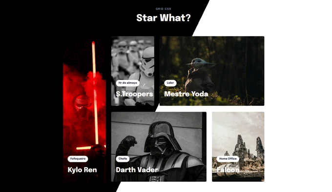

# Projeto da mentoria Rocketseta (Star What?)

 Projeto destinado a criação de um componente WEB em comemoração ao dia 4 de Maio Star Wars. Atividade de Mentoria RocketSeat.

 
 
 :fire: Proposta do projeto :nerd_face:

 <h1 align="center"> 
  
</h1>

O que acha de acessar o projeto? 
 <a href="https://oscarlojr.github.io/second_mobile_project/" target="_blank">Tela Inicial</a>